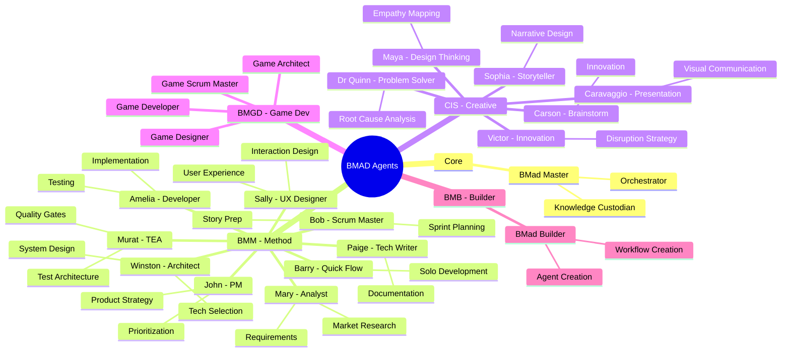
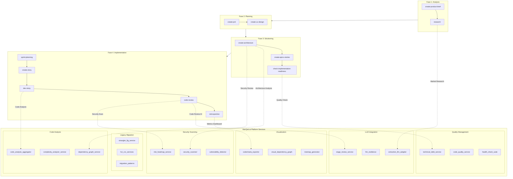
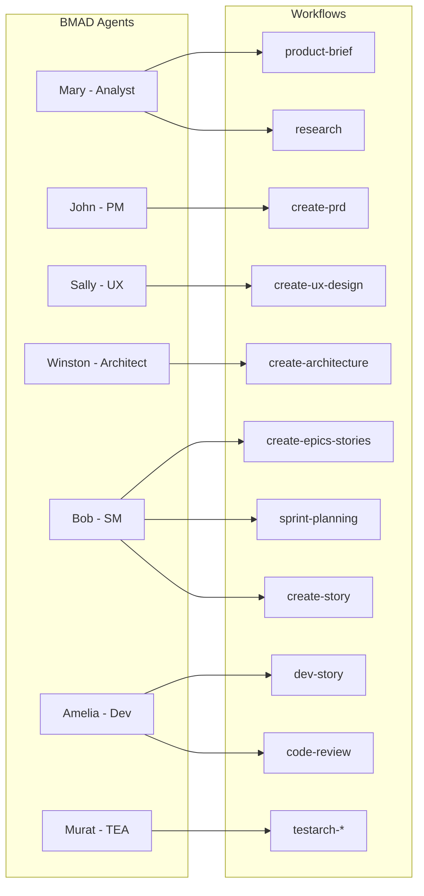
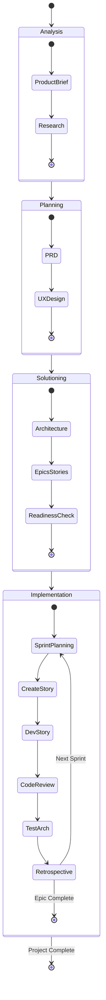
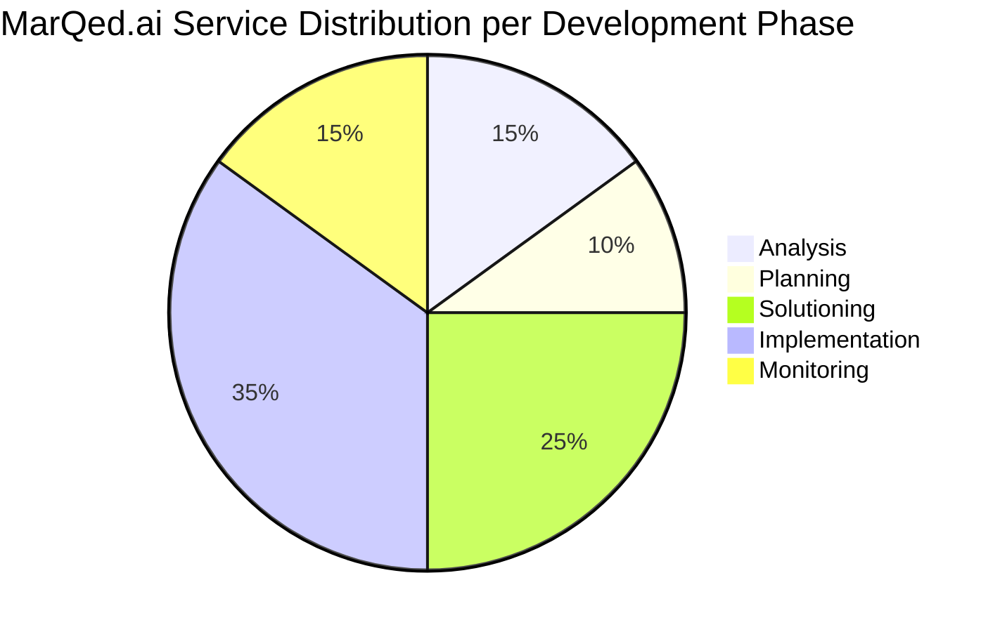

# MarQed.ai Functionaliteit & Workflow Mapping

> Gegenereerd: 2026-01-19

## 1. BMAD Agents (Wezens) Overzicht

## 2. Workflow Fases & MarQed.ai Functionaliteit Koppeling

## 3. Agent-Workflow Mapping

## 4. MarQed.ai Service-to-Workflow Integration Matrix

| Workflow | MarQed Service | Functionaliteit |
|----------|---------------|-----------------|
| **research** | `chroma_service` | Vector search voor market research |
| | `extraction_llm_adapter` | LLM-powered research synthesis |
| **create-architecture** | `dependency_graph_service` | Architectuur visualisatie |
| | `complexity_analyzer_service` | Complexity hotspot detection |
| | `visual_dependency_graph_service` | D3.js/Cytoscape graphs |
| **create-epics-stories** | `technical_debt_service` | Tech debt impact inschatting |
| | `code_analysis_aggregator` | Codebase overview |
| **sprint-planning** | `health_check_suite_service` | System health monitoring |
| | `strangler_fig_service` | Migration progress tracking |
| **dev-story** | `extraction_llm_adapter` | Code generation assistance |
| | `llm_resilience` | Retry/circuit breaker voor LLM calls |
| **code-review** | `stage_review_service` | Multi-model council review |
| | `security_scanner/` | OWASP vulnerability scan |
| | `risk_heatmap_service` | Security risk visualization |
| **testarch-*** | `test_coverage_service` | Coverage analysis |
| | `code_quality_service` | Quality metrics |
| **retrospective** | `codecharta_exporter` | 3D codebase visualization |
| | `complexity_dashboard_service` | Metrics dashboard |

## 5. Complete Agent (Wezen) Catalogus

### BMM Module (Business Method Module)

| Agent | Naam | Rol | Principes |
|-------|------|-----|-----------|
| `analyst` | Mary | Business Analyst | Evidence-based analysis, stakeholder alignment |
| `pm` | John | Product Manager | WHY-driven, data-sharp, ruthless prioritization |
| `architect` | Winston | System Architect | Boring technology, scalable patterns |
| `ux-designer` | Sally | UX Designer | User-first, empathy-driven |
| `sm` | Bob | Scrum Master | Story prep specialist, zero ambiguity |
| `dev` | Amelia | Developer | Story file = truth, red-green-refactor |
| `tea` | Murat | Test Architect | Risk-based testing, quality gates |
| `tech-writer` | Paige | Technical Writer | Clarity above all |
| `quick-flow-solo-dev` | Barry | Quick Flow Dev | Ship early, ship often |

### CIS Module (Creative Innovation Suite)

| Agent | Naam | Rol | Principes |
|-------|------|-----|-----------|
| `brainstorming-coach` | Carson | Brainstorm Facilitator | YES AND, psychological safety |
| `creative-problem-solver` | Dr. Quinn | Problem Solver | TRIZ, root cause hunting |
| `design-thinking-coach` | Maya | Design Thinking Expert | Empathy mapping, validate with users |
| `innovation-strategist` | Victor | Innovation Oracle | Blue Ocean, JTBD |
| `presentation-master` | Caravaggio | Visual Communication | 3-second rule, visual hierarchy |
| `storyteller` | Sophia | Master Storyteller | Timeless human truths |

### BMGD Module (Game Development)

| Agent | Naam | Rol | Principes |
|-------|------|-----|-----------|
| `game-architect` | Cloud Dragonborn | Game Systems Architect | Delay decisions until data |
| `game-designer` | Samus Shepard | Lead Game Designer | Design what players FEEL |
| `game-dev` | Link Freeman | Senior Game Developer | 60fps non-negotiable |
| `game-scrum-master` | Max | Game Dev Scrum Master | Every sprint = playable increment |

### Core & Builder

| Agent | Naam | Rol | Principes |
|-------|------|-----|-----------|
| `bmad-master` | BMad Master | Orchestrator | Runtime resource loading |
| `bmad-builder` | BMad Builder | System Maintainer | Practical implementation |

## 6. Workflow Lifecycle Diagram

## 7. MarQed.ai Platform Capabilities per Fase

### Per Fase Breakdown

**Analysis (15%)**
- Research automation via LLM
- Market analysis tools
- Competitive intelligence

**Planning (10%)**
- PRD templates
- UX pattern library
- Wireframe generation

**Solutioning (25%)**
- Dependency graph visualization
- Architecture analysis
- Technical debt assessment
- Security pre-scan

**Implementation (35%)**
- Multi-model code review (Stage Review)
- LLM resilience (retry, circuit breaker)
- SSE streaming
- Security scanning (OWASP)
- Health check suite
- Strangler fig migration

**Monitoring (15%)**
- CodeCharta 3D visualization
- Complexity dashboard
- Risk heatmaps
- Performance tracking
