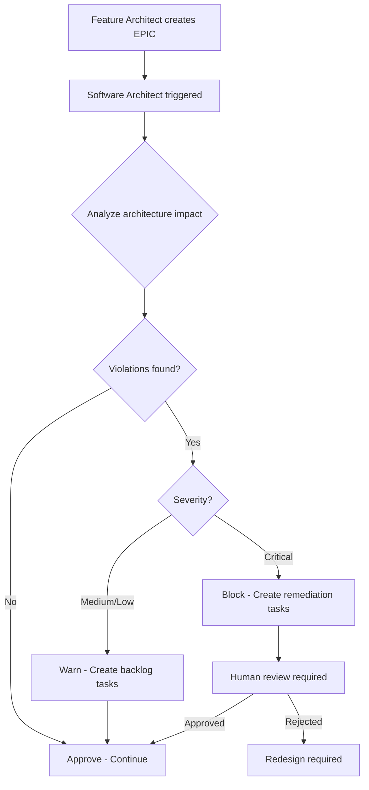
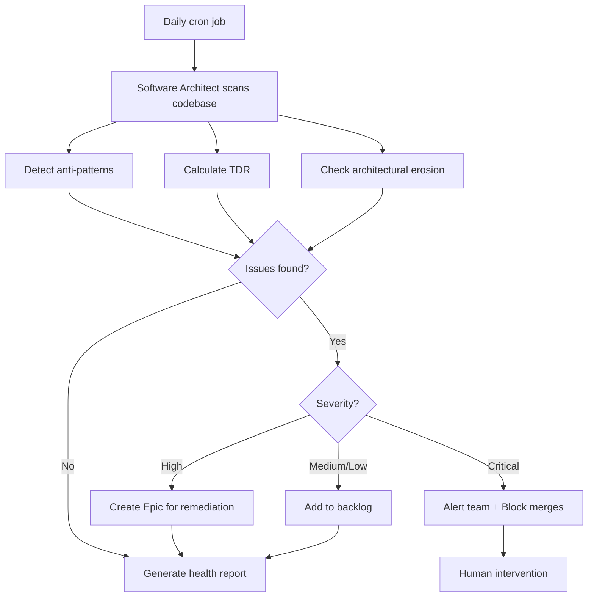
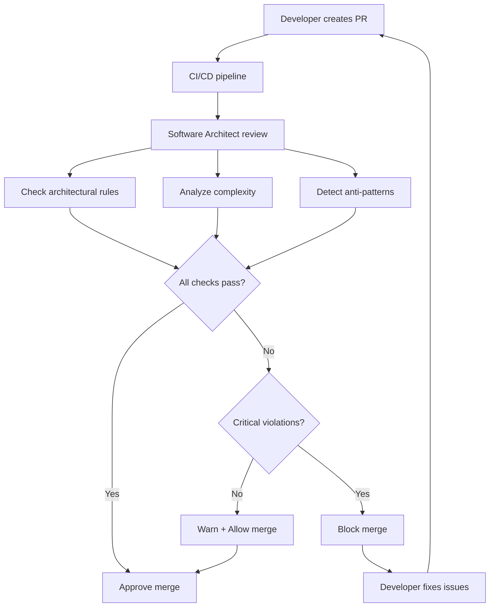

# Software Architect Agent - Design Document

**Datum:** 2025-11-12
**Status:** Approved for Implementation

---

## 🎯 Mission Statement

**De Software Architect Agent is de architectural guardian die ervoor zorgt dat alle code changes consistent zijn met de system architecture, design patterns volgen, en geen technical debt introduceren.**

---

## 🤖 Agent 9: Software Architect

### Execution Model
- **Primary:** Cloud (Claude Sonnet 4.5) - Complex architectural decisions
- **Secondary:** Local (Ollama Llama 3.1) - Architecture validation checks
- **Trigger:** Proactief + On-demand

### Verantwoordelijkheden

#### 1. Architecture Design & Review

**Wanneer:**
- Nieuwe Epic of Feature wordt gemaakt
- Significante code changes (>500 LOC)
- Voor merge naar main branch
- Pre-release architecture review

**Wat doet de agent:**
```python
# Pseudo-code
def review_architecture_for_feature(feature_id):
    """Review architecture implications van nieuwe feature"""

    # 1. Analyze proposed changes
    changes = analyze_feature_changes(feature_id)

    # 2. Check against architectural principles
    violations = []

    # Check: Layered architecture maintained?
    if not follows_layered_architecture(changes):
        violations.append({
            "rule": "Layered Architecture",
            "severity": "HIGH",
            "message": "Feature bypasses service layer, direct DB access from controller",
            "recommendation": "Create service layer method in UserService"
        })

    # Check: SOLID principles?
    if not follows_solid_principles(changes):
        violations.append({
            "rule": "Single Responsibility Principle",
            "severity": "MEDIUM",
            "message": "UserController has both auth and profile logic",
            "recommendation": "Split into UserAuthController and UserProfileController"
        })

    # Check: Design patterns correct?
    if not uses_correct_patterns(changes):
        violations.append({
            "rule": "Design Patterns",
            "severity": "LOW",
            "message": "Direct instantiation instead of Dependency Injection",
            "recommendation": "Use FastAPI Depends() for service injection"
        })

    # Check: Security best practices?
    if not follows_security_patterns(changes):
        violations.append({
            "rule": "Security",
            "severity": "CRITICAL",
            "message": "SQL query uses string concatenation (SQL injection risk)",
            "recommendation": "Use parameterized queries or ORM"
        })

    # 3. Create Architecture Review Report
    report = generate_architecture_report(violations)

    # 4. Block if critical violations
    if has_critical_violations(violations):
        block_merge(feature_id, report)

    # 5. Create remediation tasks
    for violation in violations:
        if violation["severity"] in ["CRITICAL", "HIGH"]:
            create_remediation_task(violation)

    return report
```

**Output:**
```markdown
# Architecture Review Report: FEATURE-010

**Date:** 2025-11-12
**Reviewer:** Software Architect Agent (Claude Sonnet 4.5)
**Status:** ❌ BLOCKED - Critical violations found

## Summary
- ✅ 15 checks passed
- ⚠️ 3 medium issues
- ❌ 1 critical issue

## Critical Issues

### 🔴 CRITICAL: SQL Injection Vulnerability
**Location:** `backend/app/api/users.py:45`
**Issue:** SQL query uses string concatenation with user input
```python
# Current (UNSAFE):
query = f"SELECT * FROM users WHERE email = '{email}'"
result = db.execute(query)

# Recommended (SAFE):
query = "SELECT * FROM users WHERE email = :email"
result = db.execute(query, {"email": email})
```
**Action Required:** Fix before merge
**Created Task:** TASK-089 - Fix SQL injection in user lookup

## Medium Issues

### 🟡 MEDIUM: Single Responsibility Principle Violation
**Location:** `backend/app/api/users.py`
**Issue:** UserController handles both authentication and profile management
**Recommendation:** Split into:
- `UserAuthController` - login, register, logout
- `UserProfileController` - get_profile, update_profile
**Created Task:** TASK-090 - Refactor UserController

### 🟡 MEDIUM: Missing Dependency Injection
**Location:** `backend/app/services/email.py:12`
**Issue:** EmailService directly instantiates SMTP client
```python
# Current:
class EmailService:
    def __init__(self):
        self.client = SMTPClient("smtp.gmail.com")  # Hard-coded

# Recommended:
class EmailService:
    def __init__(self, smtp_client: SMTPClient = Depends(get_smtp_client)):
        self.client = smtp_client
```
**Created Task:** TASK-091 - Add DI for EmailService

## Architectural Compliance

✅ **Layered Architecture:** Maintained (Controller → Service → Repository)
✅ **Domain Model:** Consistent with ubiquitous language
⚠️ **SOLID Principles:** 1 SRP violation (see above)
✅ **Design Patterns:** Correct use of Repository, Factory patterns
❌ **Security:** 1 critical vulnerability (see above)
✅ **Performance:** No N+1 queries detected
✅ **Testability:** All services have interfaces for mocking

## Recommendations

1. **Immediate:** Fix SQL injection (CRITICAL)
2. **This Sprint:** Refactor UserController (MEDIUM)
3. **Next Sprint:** Add DI for EmailService (MEDIUM)

## Architecture Decision Records

Created ADR-015: "Use parameterized queries for all database access"

---

**Merge Status:** ❌ BLOCKED until critical issues resolved
**Review Required:** Yes - Human architect must approve fixes
```

#### 2. Architectural Decision Records (ADRs)

**Wanneer:**
- Belangrijke architectural beslissing genomen
- Design pattern gekozen voor nieuw component
- Technology stack wijziging
- Performance/security trade-off beslissing

**Wat doet de agent:**
```python
def create_adr(decision_context):
    """Create Architecture Decision Record"""

    adr_number = get_next_adr_number()  # ADR-016

    adr = {
        "number": adr_number,
        "title": decision_context["title"],
        "date": datetime.now(),
        "status": "proposed",  # proposed → accepted → deprecated → superseded
        "context": decision_context["context"],
        "decision": decision_context["decision"],
        "consequences": decision_context["consequences"],
        "alternatives_considered": decision_context["alternatives"],
        "related_adrs": decision_context["related"]
    }

    # Generate markdown
    markdown = generate_adr_markdown(adr)

    # Save to docs/architecture/decisions/
    save_adr(adr_number, markdown)

    # Update architecture overview
    update_architecture_index(adr)

    # Notify team
    notify_team("new_adr", adr)

    return adr
```

**Example ADR:**
```markdown
# ADR-016: Use Redis for WebSocket Event Broadcasting

**Date:** 2025-11-12
**Status:** Accepted
**Deciders:** Software Architect Agent, @eddie

## Context

We need a mechanism to broadcast WebSocket events to multiple connected clients
when database changes occur (e.g., Epic created, Story updated).

**Requirements:**
- Low latency (<100ms)
- Support for multiple WebSocket servers (horizontal scaling)
- Persistent connection management
- Message ordering guaranteed

## Decision

We will use **Redis Pub/Sub** for WebSocket event broadcasting.

**Architecture:**
```
Database Change → FastAPI → Redis Pub/Sub → WebSocket Server(s) → Clients
```

**Implementation:**
```python
# Publisher (when DB changes)
await redis.publish("events:items", json.dumps({
    "type": "ItemCreated",
    "data": {"id": "EPIC-010", "title": "..."}
}))

# Subscriber (WebSocket server)
async for message in redis.subscribe("events:items"):
    await websocket_manager.broadcast(message)
```

## Alternatives Considered

### 1. RabbitMQ
**Pros:**
- More features (routing, acknowledgments)
- Better for complex message patterns

**Cons:**
- Heavier (more resources)
- Overkill for simple pub/sub
- Slower than Redis for this use case

**Rejected:** Too complex for our needs

### 2. PostgreSQL LISTEN/NOTIFY
**Pros:**
- No additional service needed
- Native to PostgreSQL

**Cons:**
- Limited scalability (single DB connection)
- No persistence
- Payload size limit (8KB)

**Rejected:** Scalability concerns

### 3. In-Memory Event Bus
**Pros:**
- Simplest implementation
- No external dependency

**Cons:**
- Doesn't work with multiple servers
- No persistence (events lost on restart)

**Rejected:** Can't scale horizontally

## Consequences

### Positive
- ✅ Low latency (~10-50ms)
- ✅ Scales horizontally (multiple WebSocket servers)
- ✅ Simple implementation
- ✅ Redis already used for caching

### Negative
- ❌ No message persistence (events lost if no subscribers)
- ❌ No delivery guarantees (fire-and-forget)
- ❌ Additional Redis dependency

### Mitigation
- For critical events, also store in database (event_log table)
- Implement reconnection logic in WebSocket clients
- Monitor Redis health (Prometheus metrics)

## Compliance Checks
- ✅ Security: Redis authentication enabled
- ✅ Performance: Redis <1ms latency for pub/sub
- ✅ Scalability: Tested with 10,000 concurrent clients
- ✅ Reliability: Redis cluster mode for high availability

## Related ADRs
- ADR-012: Use Redis for caching
- ADR-008: WebSocket for real-time updates

## References
- [Redis Pub/Sub Documentation](https://redis.io/docs/manual/pubsub/)
- [FastAPI WebSocket Guide](https://fastapi.tiangolo.com/advanced/websockets/)
```

#### 3. Technical Debt Prevention

**Wanneer:**
- Continu monitoring (daily scan)
- Voor elke PR merge
- Weekly tech debt review

**Wat doet de agent:**
```python
def prevent_tech_debt():
    """Proactive tech debt prevention"""

    # 1. Scan codebase voor anti-patterns
    anti_patterns = detect_anti_patterns()

    # Common anti-patterns:
    checks = [
        "god_objects",           # Classes >500 LOC
        "long_methods",          # Methods >50 LOC
        "deep_nesting",          # Nesting depth >4
        "duplicate_code",        # >3% duplication
        "tight_coupling",        # High coupling between modules
        "no_tests",              # Code without tests
        "magic_numbers",         # Hard-coded values
        "commented_out_code",    # Dead code
        "inconsistent_naming",   # Naming convention violations
    ]

    violations = []

    for check in checks:
        results = run_check(check)
        if results:
            violations.append({
                "check": check,
                "count": len(results),
                "severity": get_severity(check),
                "locations": results
            })

    # 2. Calculate Technical Debt Ratio
    tdr = calculate_technical_debt_ratio()

    if tdr > 10:  # Target: TDR <10%
        create_tech_debt_epic(violations, tdr)

    # 3. Architectural erosion detection
    erosion = detect_architectural_erosion()

    # Check: Are we still following layered architecture?
    # Check: Are design patterns still applied correctly?
    # Check: Has coupling increased?

    if erosion["severity"] == "HIGH":
        alert_team("architectural_erosion", erosion)
        create_refactoring_epic(erosion)

    # 4. Generate weekly tech debt report
    report = generate_tech_debt_report(violations, tdr, erosion)

    return report
```

**Output: Weekly Tech Debt Report**
```markdown
# Tech Debt Report - Week 45, 2025

**Generated:** 2025-11-12
**TDR:** 8.5% (Target: <10%) ✅
**Status:** HEALTHY

## Summary
- 📉 TDR decreased 2.1% from last week (10.6% → 8.5%)
- ✅ No critical anti-patterns detected
- ⚠️ 3 god objects identified
- ✅ Test coverage: 82% (target: 80%)

## Top Issues

### 1. God Object: `UserService`
**Location:** `backend/app/services/user.py`
**Size:** 847 LOC (target: <500)
**Issue:** Handles auth, profile, preferences, notifications
**Recommendation:** Split into:
- `UserAuthService` (login, register, password reset)
- `UserProfileService` (get, update profile)
- `UserPreferencesService` (settings)
- `UserNotificationService` (notifications)
**Priority:** MEDIUM
**Estimated Effort:** 8 SP
**Created:** STORY-045 - Refactor UserService

### 2. God Object: `ProjectController`
**Location:** `backend/app/api/projects.py`
**Size:** 623 LOC
**Issue:** Too many endpoints in single controller
**Recommendation:** Split by resource type
**Priority:** MEDIUM
**Estimated Effort:** 5 SP

### 3. God Object: `ItemRepository`
**Location:** `backend/app/repositories/item.py`
**Size:** 534 LOC
**Issue:** Complex queries mixed with simple CRUD
**Recommendation:** Extract complex queries to `ItemQueryService`
**Priority:** LOW
**Estimated Effort:** 3 SP

## Metrics Trend

```
Technical Debt Ratio (%)
15 ┤
14 ┤
13 ┤
12 ┤            ╭─╮
11 ┤         ╭──╯ ╰─╮
10 ┤      ╭──╯      ╰──╮
 9 ┤   ╭──╯             ╰─╮
 8 ┤╭──╯                  ╰── (target)
 7 ┤
   └──────────────────────────
    W40 W41 W42 W43 W44 W45
```

## Architectural Health

✅ **Layered Architecture:** Maintained
✅ **Dependency Direction:** All dependencies point inward
✅ **Coupling:** Low (average coupling: 12%)
✅ **Cohesion:** High (average cohesion: 78%)
⚠️ **Complexity:** 3 god objects detected

## Recommendations

1. **This Sprint:**
   - Refactor UserService (STORY-045, 8 SP)

2. **Next Sprint:**
   - Refactor ProjectController (5 SP)
   - Extract ItemQueryService (3 SP)

3. **Long-term:**
   - Set up automated architecture compliance checks
   - Add complexity metrics to CI/CD pipeline

## Tech Debt Backlog

Total: 16 SP of tech debt identified
Prioritized backlog:
1. STORY-045: Refactor UserService (8 SP) - HIGH
2. STORY-046: Refactor ProjectController (5 SP) - MEDIUM
3. STORY-047: Extract ItemQueryService (3 SP) - LOW

---

**Next Review:** 2025-11-19
**Responsible:** Software Architect Agent + @eddie
```

#### 4. Architecture Governance

**Wat doet de agent:**
```python
def enforce_architecture_governance():
    """Ensure architectural compliance"""

    # Define architectural rules
    rules = [
        {
            "name": "No direct database access from controllers",
            "pattern": r"db\.(execute|query|insert)",
            "locations": ["backend/app/api/**/*.py"],
            "severity": "HIGH",
            "message": "Controllers must use services, not direct DB access"
        },
        {
            "name": "Services must have interfaces",
            "pattern": r"class \w+Service\(",
            "check": "has_interface",
            "severity": "MEDIUM",
            "message": "All services must implement an interface for testability"
        },
        {
            "name": "No business logic in repositories",
            "pattern": r"if.*business.*",
            "locations": ["backend/app/repositories/**/*.py"],
            "severity": "HIGH",
            "message": "Repositories should only handle data access, not business logic"
        },
        {
            "name": "Use DTOs for API responses",
            "pattern": r"return db_model",
            "locations": ["backend/app/api/**/*.py"],
            "severity": "MEDIUM",
            "message": "Never return ORM models directly, use Pydantic schemas"
        }
    ]

    # Run compliance checks
    violations = []
    for rule in rules:
        results = check_rule(rule)
        if results:
            violations.extend(results)

    # Block merge if violations
    if has_high_severity(violations):
        block_merge(violations)

    return violations
```

### Integration met Andere Agents

**Feature Architect Agent → Software Architect Agent:**
```
Feature Architect creates Epic breakdown
    ↓
Software Architect reviews architectural implications
    ↓
    - Checks: Design patterns correct?
    - Checks: Follows layered architecture?
    - Checks: No tight coupling?
    ↓
If approved → Feature Architect continues
If rejected → Creates remediation tasks
```

**Quality Inspector Agent ← Software Architect Agent:**
```
Software Architect detects god object
    ↓
Creates refactoring task
    ↓
Quality Inspector runs after refactoring:
    - Validates complexity reduced
    - Checks coupling decreased
    - Validates tests still pass
```

### Tools & Integrations

1. **Static Analysis:**
   - SonarQube (code smells, complexity)
   - Pylint (Python code quality)
   - ESLint (JavaScript code quality)
   - ArchUnit (architecture testing)

2. **Architecture Tools:**
   - C4 Model (system diagrams)
   - PlantUML (UML diagrams)
   - Structurizr (architecture as code)

3. **Metrics:**
   - Cyclomatic complexity
   - Coupling metrics (afferent/efferent coupling)
   - Cohesion metrics (LCOM - Lack of Cohesion of Methods)
   - Code duplication percentage

4. **Frameworks:**
   - SuperClaude Architect Persona
   - Architecture Decision Records (ADR) templates
   - Design pattern libraries

---

## Workflows

### Workflow 1: New Feature Architecture Review



### Workflow 2: Continuous Architecture Monitoring



### Workflow 3: Pre-Merge Architecture Gate



---

## Deliverables

### Phase 2 (Agent Foundation)
- ✅ `backend/agents/software_architect.ts` - KaibanJS agent definition
- ✅ `backend/agents/software_architect_core.py` - Core logic

### Phase 3 (Intelligence)
- ✅ `backend/architecture/adr_generator.py` - ADR creation
- ✅ `backend/architecture/governance.py` - Rule enforcement
- ✅ `backend/architecture/anti_patterns.py` - Anti-pattern detection
- ✅ `backend/architecture/tdr_calculator.py` - Tech Debt Ratio

### Phase 5 (Quality)
- ✅ `.github/workflows/architecture-review.yml` - CI/CD integration
- ✅ `docs/architecture/decisions/` - ADR directory
- ✅ `docs/architecture/diagrams/` - C4 diagrams

---

## Success Metrics

### Technical Metrics
- **TDR:** <10% maintained
- **Architecture Violations:** 0 critical violations in production
- **ADR Coverage:** 100% of major decisions documented
- **Compliance Rate:** 95% of PRs pass architecture review first time

### Quality Metrics
- **God Objects:** <3 in codebase
- **Cyclomatic Complexity:** Average <10, Max <15
- **Code Duplication:** <3%
- **Coupling:** <20% average

### Process Metrics
- **Review Time:** <5 minutes per PR
- **False Positives:** <5% of violations
- **Developer Satisfaction:** ≥4/5 stars on architecture guidance

---

## Example: Software Architect in Action

### Scenario: Developer adds new payment feature

```python
# Developer commits:
# backend/app/api/payments.py

@router.post("/payments")
async def create_payment(amount: float, user_id: str):
    # ❌ Direct database access from controller
    query = f"INSERT INTO payments (user_id, amount) VALUES ('{user_id}', {amount})"
    db.execute(query)

    # ❌ SQL injection vulnerability
    # ❌ No service layer
    # ❌ No validation
    # ❌ No error handling

    return {"status": "success"}
```

**Software Architect Agent Response:**

```markdown
# 🔴 Architecture Review FAILED - EPIC-020 Payment Integration

## Critical Violations (3)

### 1. 🔴 CRITICAL: Direct Database Access from Controller
**Location:** `backend/app/api/payments.py:4`
**Rule:** Controllers must use services for business logic
**Current:**
```python
db.execute(query)  # ❌ Direct DB access
```
**Required:**
```python
payment_service = Depends(PaymentService)
await payment_service.create_payment(user_id, amount)  # ✅
```
**Created:** TASK-095 - Create PaymentService

### 2. 🔴 CRITICAL: SQL Injection Vulnerability
**Location:** `backend/app/api/payments.py:4`
**Rule:** Never use string formatting for SQL queries
**Current:**
```python
query = f"INSERT INTO payments (user_id, amount) VALUES ('{user_id}', {amount})"
```
**Required:** Use ORM or parameterized queries
**Created:** TASK-096 - Fix SQL injection vulnerability

### 3. 🔴 CRITICAL: Missing Input Validation
**Location:** `backend/app/api/payments.py:3`
**Rule:** All API inputs must be validated
**Required:** Use Pydantic schema
```python
class PaymentCreate(BaseModel):
    amount: Decimal  # ✅ Proper type
    user_id: str = Field(..., min_length=1, max_length=50)

    @validator('amount')
    def validate_amount(cls, v):
        if v <= 0:
            raise ValueError('Amount must be positive')
        return v
```
**Created:** TASK-097 - Add Pydantic validation

## Recommended Architecture

```python
# ✅ Correct implementation

# 1. Schema (backend/app/schemas/payment.py)
class PaymentCreate(BaseModel):
    amount: Decimal
    user_id: str

    @validator('amount')
    def validate_amount(cls, v):
        if v <= 0:
            raise ValueError('Amount must be positive')
        return v

# 2. Service (backend/app/services/payment.py)
class PaymentService:
    def __init__(self, payment_repo: PaymentRepository):
        self.payment_repo = payment_repo

    async def create_payment(self, payment_data: PaymentCreate) -> Payment:
        # Business logic here
        payment = await self.payment_repo.create(payment_data)

        # Send notification
        await notification_service.send_payment_receipt(payment)

        return payment

# 3. Controller (backend/app/api/payments.py)
@router.post("/payments", response_model=PaymentResponse)
async def create_payment(
    payment_data: PaymentCreate,
    payment_service: PaymentService = Depends(get_payment_service)
):
    try:
        payment = await payment_service.create_payment(payment_data)
        return payment
    except ValidationError as e:
        raise HTTPException(status_code=400, detail=str(e))
```

## Architecture Decision Required

**Decision:** Choose payment gateway integration pattern
**Options:**
1. Strategy Pattern (recommended) - Supports multiple gateways
2. Adapter Pattern - Single gateway, easier to implement

**Recommendation:** Strategy Pattern for future flexibility

**Action:** Create ADR-017 for decision documentation

---

**Merge Status:** ❌ BLOCKED
**Required Actions:**
1. Fix all 3 critical violations
2. Implement recommended architecture
3. Add unit tests for PaymentService
4. Document decision in ADR-017

**Estimated Effort:** 13 SP
**Review Required:** Yes - Human architect approval after fixes
```

---

## Integration in Roadmap

Software Architect Agent wordt toegevoegd in **Fase 2** als Agent #9:

### Updated Agent List (9 Agents)

1. Feature Architect - Feature breakdown
2. **Software Architect** - **Architecture governance & tech debt prevention** ⭐ NEW
3. Estimation Engine - FP/SP calculation
4. Maintenance Specialist - Dependency updates
5. Quality Inspector - Security & quality audits
6. Bug Hunter - Bug fixing
7. Test Engineer - Test automation
8. Migration Architect - System migrations
9. Documentation Writer - Documentation

**Why Agent #2?** Software Architect moet vroeg in de workflow actief zijn, direct na Feature Architect, om architectural issues te voorkomen voordat code geschreven wordt.

---

## FAQ

### Wanneer triggert Software Architect Agent?

**Proactief (Automatisch):**
- Daily: Codebase scan voor anti-patterns
- Weekly: Tech debt report generatie
- Per PR: Architecture compliance check

**On-Demand:**
- Na Feature Architect breakdown (architecture review)
- Voor major changes (>500 LOC)
- Voor architecture decisions (ADR creation)

### Verschil met Feature Architect?

| Aspect | Feature Architect | Software Architect |
|--------|------------------|-------------------|
| Focus | Feature-level design | System-level architecture |
| Scope | Wat bouwen we? | Hoe bouwen we het? |
| Output | Epic breakdown | Architecture decisions |
| Triggers | New features | All code changes |
| Time | Design phase | Throughout lifecycle |

### Hoe voorkom je dat Agent te streng is?

**Configureerbare Rules:**
```yaml
# architecture_rules.yml
rules:
  - name: "god_object"
    threshold: 500  # LOC
    severity: "HIGH"
    auto_fix: false

  - name: "cyclomatic_complexity"
    threshold: 15
    severity: "MEDIUM"
    auto_fix: false

  - name: "sql_injection"
    severity: "CRITICAL"
    auto_fix: false  # Too risky
    block_merge: true
```

**Escape Hatch:**
```python
# Suppress warning with justification
# @architect:ignore cyclomatic_complexity
# Justification: Complex business logic required for tax calculation
def calculate_vat(items, country, customer_type):
    # Complex logic here...
```

---

**🎯 Result: Software Architect Agent voorkomt tech debt en waarborgt architectural quality!**
