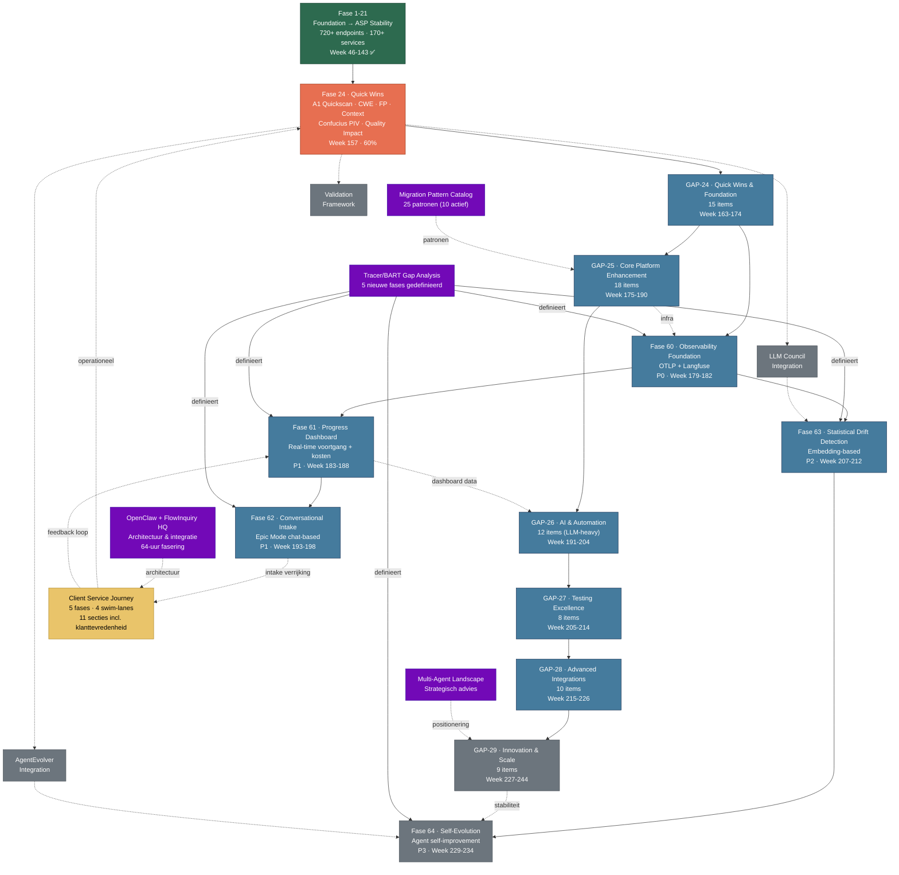

# MarQed.ai — Roadmap Afhankelijkheidsdiagram

**Week:** 162 (2026-01-31)
**Type:** Visueel overzicht

---

## Fase-afhankelijkheden

## Legenda

| Kleur | Betekenis |
|-------|-----------|
| 🟢 Groen | Afgerond (Fase 1-21) |
| 🟠 Oranje | Actief / in uitvoering |
| 🔵 Blauw | Gepland (concrete weken) |
| ⚫ Grijs | Toekomst (week 227+) |
| 🟣 Paars | Strategische documenten |
| 🟡 Geel | Client Service Journey |

**Doorgetrokken lijn** = directe afhankelijkheid
**Stippellijn** = indirecte relatie / informatie-stroom

---

## Twee parallelle tracks

| Track | Fases | Focus | Doorlooptijd |
|-------|-------|-------|--------------|
| **Platform (GAP)** | GAP-24 → GAP-29 | 75 gaps, core platform opbouw | Week 163-244 (82 weken) |
| **Tracer/BART** | Fase 60 → 64 | Observability, dashboard, AI intake, drift, self-evolution | Week 179-234 (55 weken) |

Beide tracks starten vanuit **GAP-24** en convergeren bij **GAP-29 / Fase 64** (Innovation & Scale + Self-Evolution).
